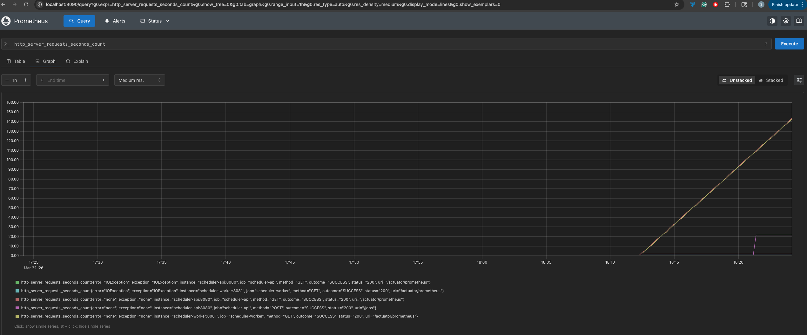
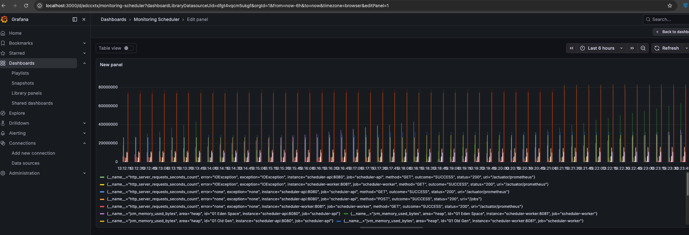

# Distributed Job Scheduler

A fault-tolerant distributed job scheduling system built with:

- Java
- Spring Boot
- Redis
- Kafka
- Docker

## Features

- Delayed jobs
- Cron scheduling
- Fault tolerant retries
- Distributed workers
- Job prioritization
- Horizontal scalability

## Architecture

Client → Scheduler API → Kafka Queue → Worker Nodes → Execution

## Tech Stack

Java, Spring Boot, Redis, Kafka, Docker, Kubernetes

